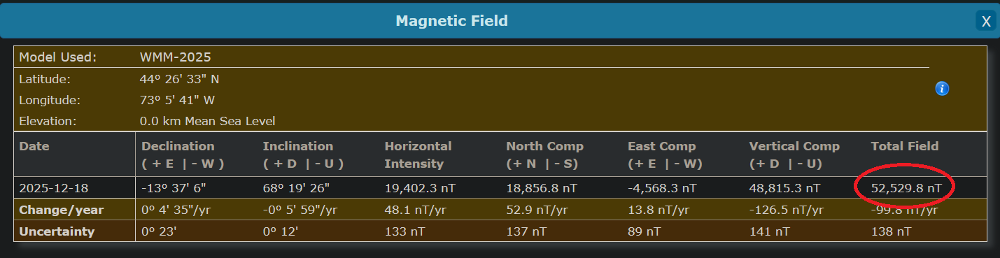

# Application User Guide
This guide outlines how to use the command-line application tools in the suite.

## Fit Calibration
Use the `microstrain-mag-cal` tool to fit calibrations. For a list of options, run:
```
microstrain-mag-cal --help
```

### Reference Field Strength
The tool will automatically estimate the field strength given the input data if no reference field
strength is given.

However, specifying the reference field strength for the location where data is sampled from will
greatly improve the resulting calibration.

The reference field strength can be retrieved from the
[NOAA calculator](https://www.ngdc.noaa.gov/geomag/calculators/magcalc.shtml#igrfwmm). It will be
the `Total Field` attribute in the calculator results:



The result will likely be in
[Nanotesla](https://en.wikipedia.org/wiki/Tesla_(unit)), while the application expects it
to be [Gauss](https://en.wikipedia.org/wiki/Gauss_(unit)). This conversion must be
done manually; the application does not support it automatically (yet).

The conversion is done using the following formula:
```
R_Gauss = R_Nanotesla * 0.00001
```

It is recommended to use the *World Magnetic Model* (WMM) for the model in the calculator:


## Apply Calibration To The Device
Use the `microstrain-mag-cal-apply` tool to apply a calibration to the device. For a list of options, run:
```
microstrain-mag-cal-apply --help
```

## Example Workflow
This command reads magnetometer data from a file and fits two calibrations 
against the reference field strength: 

```
microstrain-mag-cal "mag_cal_example.bin" -f 0.12345 -s -e -j "example_directory"
```

One calibration uses the [ellipsoidal fit function](../README.md#fit-functions), while the other uses 
the [spherical fit function](../README.md#fit-functions). The calibration files are written to the 
directory: `example_directory`.

The calibrations can then be applied to the device. For example, this command applies the *ellipsoidal
fit* calibration to the device on port `COM37`, connecting with a baudrate of `115200`:

```
microstrain-mag-cal-apply "example_directory/ellipsoidal_fit.json" COM37 -b 115200
```
