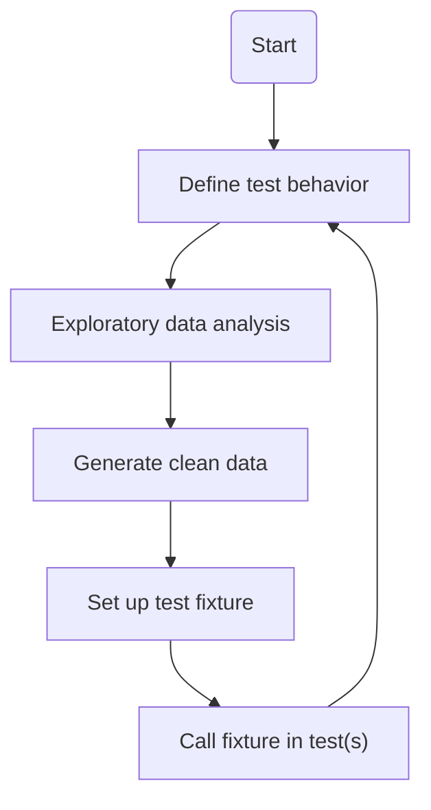

# Test data generation
This subdirectory contains scripts for generating synthetic data to use in the automated test suite. 
It uses Python for these scripts. 

## Setup
NOTE: A working [Python 3](https://www.python.org/) installation is required before setup. Check 
the script for the version requirements.

To set up the Python environment, run the setup script in this directory:
```
./setup.sh
```

This assumes you're running on Linux/Mac, or Windows with Git bash or some other Unix environment.
Batch/powershell support can be added relatively easily if needed, just translate the contents of 
that script.

Now verify that the setup worked:
```
pdm --version
```

If that fails, you likely have to restart the terminal session to update the path. If you need to 
stay in the current session, run it with your Python installation:
```
python -m pdm --version
```

You should now be all setup!

## Generating data for tests
The process for generating data for tests is as follows:


### Exploratory data analysis
The first step is to perform exploratory data analysis. You can do this by running the analysis 
script:
```
pdm run scripts/analyze_noisy_data.py
```

You can modify the inputs for the script, such as the expected error coefficients. The script will 
then generate the data with known error and create a plot to visualize it. You can experiment with
it to see how different inputs affect the data with error. This allows you to find a good set of 
inputs for data that will reflect the desired behavior to test.

### Using the data in tests 
Once you have a good set of inputs to generate your test data, run the generation script:
```
pdm run scripts/generate_clean_data.py
```

This automatically creates a C++ header file with clean data as a matrix. This matrix can then be 
used by any test fixtures to set up the error data for the test. The fixture(s) should take some
inputs, and apply operations on the clean data to give a known error result. They can then be 
called by the relevant tests, passing the inputs from the exploratory data analysis.
